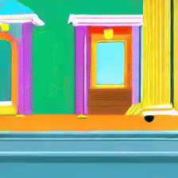
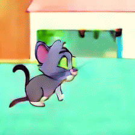

# Sana / Sana Sprint / Sana Video – Research Experiments

This repo is a **research playground** for experiments on top of `SANA` and `Sana Sprint` diffusion models.  
It currently includes **prototype code**, **one-off experiments**, and **work-in-progress training scripts** (LoRA, DreamBooth-style tuning, zoom conditioning, control net etc).

## Sana-Video Tom & Jerry Experiment

This experiment fine-tunes **SANA-Video (2B)** with **LoRA** on a dataset of _Tom and Jerry_ clips resized to **224×224**.  
The base model is originally trained for higher resolutions (e.g. 480p), so its **zero-shot** generations at 224×224 look off-style and are not well aligned with classic 2D slapstick cartoons.

By training only the video transformer with a Tom & Jerry–style class prompt and LoRA adapters, the model progressively adapts its **visual style, color palette, and motion dynamics** toward the target domain.

### Qualitative samples

| Checkpoint                  | Sample (animated GIF) |
|----------------------------|------------------------|
| Zero-shot (no fine-tuning) |  |
| LoRA – after 100 steps     |  |
| LoRA – after 200 steps     |  |